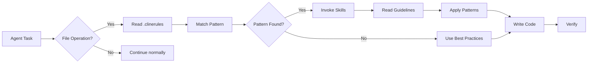

# Agent Skills Enforcement System

**A comprehensive system for ensuring AI agents follow project-specific coding patterns and best practices.**

---

## Quick Start

### For AI Agents
1. **ALWAYS read [`.clinerules`](../.clinerules) FIRST** before any code modification
2. Match file patterns to required skills
3. Invoke skills using the Skill tool
4. Apply skill guidelines to your implementation

### For Developers
1. Read **[`ENFORCEMENT.md`](./ENFORCEMENT.md)** for complete guide
2. Browse **[`agents/`](../agents/)** directory to see all patterns
3. Consult **[`AGENTS.md`](../AGENTS.md)** for skills catalog

---

## System Files

| File | Purpose | Audience |
|------|---------|----------|
| [`.clinerules`](../.clinerules) | **PRIMARY** mandatory rules | AI Agents (read FIRST) |
| [`rules.md`](./rules.md) | Technical implementation details | AI Agents |
| [`skills-map.json`](./skills-map.json) | Machine-readable pattern mappings | AI Agents (automation) |
| [`ENFORCEMENT.md`](./ENFORCEMENT.md) | Human-readable comprehensive guide | Developers, Team |

---

## How It Works



---

## Pattern Examples

### Frontend

```
src/pages/login.astro
  ↓ matches: src/pages/**/*.astro
  → Skills: muebleria-astro, muebleria-ui

src/components/auth/LoginForm.tsx
  ↓ matches: **/*Form*.tsx
  → Skills: muebleria-forms, muebleria-react
```

### Backend

```
backend/app/routes/auth.py
  ↓ matches: backend/app/routes/**/*.py
  → Skills: muebleria-api, muebleria-python

backend/app/models.py
  ↓ matches exactly
  → Skills: muebleria-db, muebleria-python
```

---

## Key Features

### ✅ Enforced Consistency
- All agents follow the same patterns
- Code reviews focus on logic, not style
- Onboarding is faster with clear guidelines

### 📋 Pattern Matching
- Automatic skill selection via glob patterns
- Priority system for conflicting matches
- Fallback to best practices when no match

### 🔄 Extensible
- Easy to add new skills
- Update patterns without changing code
- Skills version independently

### 📊 Auditable
- Clear documentation of all rules
- Machine-readable for automation
- Human-readable for understanding

---

## Best Practices

### Writing Skills

✅ **DO**:
- Be specific and actionable
- Include code examples
- Explain reasoning behind patterns
- Keep skills focused (single concern)

❌ **DON'T**:
- Write vague guidelines
- Mix unrelated concerns
- Assume prior knowledge
- Let skills become stale

### Using the System

✅ **DO**:
- Read `.clinerules` before coding
- Invoke all matching skills
- Follow patterns exactly
- Propose improvements via PR

❌ **DON'T**:
- Skip skills for "speed"
- Ignore patterns (discuss instead)
- Create undocumented exceptions
- Forget to update skills

---

## File Structure

```
.opencode/
├── README.md               ← You are here
├── rules.md                ← Technical agent guide
├── skills-map.json         ← Pattern-to-skill mappings
└── ENFORCEMENT.md          ← Complete human guide

../.clinerules              ← PRIMARY rules (read first!)
../AGENTS.md                ← Skills catalog
../agents/                  ← Individual skill implementations
```

---

## Common Workflows

### Creating a New Component

```bash
# Agent receives task
"Create src/components/ui/Modal.tsx"

# Agent process:
1. Read .clinerules
2. Match: src/components/ui/**/*.tsx
3. Invoke: muebleria-react, muebleria-ui
4. Read both skill guidelines
5. Create component following patterns:
   - TypeScript with proper types
   - React 19 patterns (no useMemo)
   - TailwindCSS 4 utilities
   - Accessible ARIA attributes
6. Verify against skill checklists
```

### Adding a New Skill

```bash
# 1. Create skill directory
mkdir -p agents/my-new-skill

# 2. Copy template
cp agents/_template/SKILL.md agents/my-new-skill/

# 3. Edit skill file
# Add patterns, examples, guidelines

# 4. Update .clinerules
# Add pattern → skill mapping

# 5. Update skills-map.json
# Add to patterns and skillMetadata

# 6. Test with agent
# Ask agent to use the new skill

# 7. Commit
git add .clinerules .opencode/ agents/my-new-skill/
git commit -m "feat(skills): add my-new-skill"
```

---

## Troubleshooting

### Agent Not Following Skills

**Symptoms**: Code doesn't match patterns

**Solutions**:
1. Verify `.clinerules` exists and is readable
2. Check agent has Skill tool access
3. Explicitly say: "Follow .clinerules strictly"
4. Check skills are up-to-date

### Pattern Not Matching

**Symptoms**: Agent says "no pattern found"

**Solutions**:
1. Check pattern syntax in `.clinerules`
2. Test pattern with glob tester
3. Add more specific pattern if needed
4. Document as exception if intentional

### Skills Conflicting

**Symptoms**: Two skills recommend different patterns

**Solutions**:
1. Check priority in `skills-map.json`
2. More specific pattern should win
3. Update skills to clarify
4. Discuss with team if unclear

---

## Metrics

Track these to measure effectiveness:

- **Pattern Coverage**: % of files with matching patterns
- **Agent Compliance**: % of times skills were invoked correctly
- **Code Consistency**: % of PRs passing style review first time
- **Onboarding Speed**: Time to first PR for new team members

---

## Version History

- **v1.0.0** (2026-01-20): Initial system
  - Created `.clinerules`
  - Created `.opencode/` directory structure
  - Defined 15 initial skills
  - Established enforcement protocol

---

## Resources

### Documentation
- **[ENFORCEMENT.md](./ENFORCEMENT.md)** - Complete guide (START HERE for humans)
- **[rules.md](./rules.md)** - Technical details for agents
- **[AGENTS.md](../AGENTS.md)** - Skills catalog

### Code
- **[agents/](../agents/)** - All skill implementations
- **[`.clinerules`](../.clinerules)** - Primary rules file

### External
- [Glob Pattern Tester](https://globster.xyz/)
- [JSON Schema Validator](https://www.jsonschemavalidator.net/)

---

## Contributing

### Improving the System

1. Identify gap or inconsistency
2. Propose change (create issue or discuss)
3. Update relevant files:
   - `.clinerules` (if pattern changes)
   - `skills-map.json` (if mappings change)
   - Skill files (if guidelines change)
   - This README (if system changes)
4. Test with agents
5. Submit PR with clear description

### Questions?

- Check **[ENFORCEMENT.md](./ENFORCEMENT.md)** first
- Ask in team chat
- Open an issue for bugs
- Submit PR for improvements

---

## License

Same as parent project (MuebleriaIris)

---

**Last Updated**: 2026-01-20  
**Maintained By**: MuebleriaIris Development Team  
**Status**: Active and Enforced  
**Version**: 1.0.0
