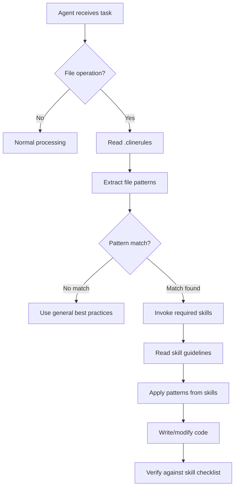

# MuebleriaIris - Technical Rules & Implementation Guide

> **Purpose**: Detailed technical specifications for agent behavior and skills invocation
> **Audience**: AI Agents, Developers configuring agent behavior
> **Status**: Active
> **Version**: 1.0.0

---

## Table of Contents

1. [Overview](#overview)
2. [Enforcement Mechanism](#enforcement-mechanism)
3. [Skills Invocation Patterns](#skills-invocation-patterns)
4. [Technology Stack & Versions](#technology-stack--versions)
5. [Code Style Guidelines](#code-style-guidelines)
6. [Decision Trees](#decision-trees)
7. [Edge Cases](#edge-cases)
8. [Performance Considerations](#performance-considerations)

---

## Overview

### Purpose of This System

The MuebleriaIris project uses a **skill-based agent orchestration system** to ensure:

1. **Consistency**: All code follows established patterns
2. **Quality**: Leverages accumulated knowledge in specialized skills
3. **Maintainability**: New agents can quickly understand project standards
4. **Scalability**: Easy to add new skills as project grows

### File Hierarchy

```
.clinerules              (Primary - Always read first)
├── .opencode/
│   ├── rules.md         (This file - Technical details)
│   ├── skills-map.json  (Machine-readable skill mapping)
│   └── ENFORCEMENT.md   (Documentation for humans)
├── AGENTS.md            (Agent catalog & quick reference)
└── agents/              (Individual skill implementations)
    ├── muebleria-ui/
    ├── muebleria-astro/
    ├── muebleria-react/
    └── ...
```

### Reading Priority

1. `.clinerules` - **MUST read FIRST**
2. `.opencode/skills-map.json` - For quick pattern matching
3. Specific skill files - For detailed implementation guidance
4. `AGENTS.md` - For context and skill descriptions

---

## Enforcement Mechanism

### How Rules Are Enforced



### Verification Points

Agents should self-verify at these checkpoints:

**Checkpoint 1: Before Starting**
```
Q: Am I about to create or modify a file?
A: YES → Continue to Checkpoint 2
A: NO  → Skip skills invocation
```

**Checkpoint 2: Pattern Matching**
```
Q: Does the file path match any pattern in .clinerules?
A: YES → Continue to Checkpoint 3
A: NO  → Document why no pattern matched, use best practices
```

**Checkpoint 3: Skills Invocation**
```
Q: Have I invoked ALL required skills for this pattern?
A: YES → Continue to Checkpoint 4
A: NO  → STOP and invoke missing skills
```

**Checkpoint 4: Guidelines Application**
```
Q: Am I following ALL patterns from the invoked skills?
A: YES → Proceed with implementation
A: NO  → Review skills again and align implementation
```

---

## Skills Invocation Patterns

### Pattern Matching Algorithm

```typescript
function matchSkills(filePath: string): string[] {
  const patterns = {
    // Frontend
    'src/pages/**/*.astro': ['muebleria-astro', 'muebleria-ui'],
    'src/layouts/**/*.astro': ['muebleria-astro', 'muebleria-ui'],
    'src/components/ui/**/*.tsx': ['muebleria-react', 'muebleria-ui'],
    'src/components/**/*Form*.tsx': ['muebleria-forms', 'muebleria-react'],
    'src/components/mobile/**/*': ['muebleria-mobile', 'muebleria-ui'],
    
    // Backend
    'backend/app/routes/**/*.py': ['muebleria-api', 'muebleria-python'],
    'backend/app/models.py': ['muebleria-db', 'muebleria-python'],
    'backend/app/auth/**/*.py': ['muebleria-security', 'muebleria-python'],
    
    // Testing
    '**/*.test.tsx': ['muebleria-test-ui'],
    '**/*.spec.ts': ['muebleria-test-ui'],
    'backend/tests/**/*.py': ['muebleria-test-api'],
    
    // Docs
    '**/*.md': ['muebleria-docs'],
  };
  
  // Use glob matching to find applicable patterns
  return patterns[matchGlob(filePath)] || [];
}
```

### Multiple Files Operations

When modifying multiple files in one operation:

1. **Collect all patterns** from all files
2. **Deduplicate skills** (invoke each skill once)
3. **Invoke in priority order**:
   - Language/framework skills first (astro, react, python)
   - Specialized skills second (forms, security, db)
   - UI/design skills last (ui, mobile)

**Example**:
```
Files: 
- src/pages/login.astro
- src/components/auth/LoginForm.tsx

Skills needed:
- muebleria-astro (from login.astro)
- muebleria-ui (from login.astro)
- muebleria-forms (from LoginForm.tsx)
- muebleria-react (from LoginForm.tsx)

Invoke order:
1. muebleria-astro
2. muebleria-react
3. muebleria-forms
4. muebleria-ui
```

---

## Technology Stack & Versions

### Critical Version Requirements

```yaml
frontend:
  framework: "astro@5.16.4"
  react: "19.2.1"
  styling: "tailwindcss@4.1.17"
  typescript: "^5.0.0"
  state: "nanostores@^0.9.0"

backend:
  language: "python@^3.9"
  framework: "flask@^2.3.0"
  orm: "sqlalchemy@^2.0.0"
  database: "postgresql@15"

testing:
  e2e: "playwright@latest"
  unit_frontend: "@testing-library/react@^14.0.0"
  unit_backend: "pytest@^7.0.0"
```

### Version-Specific Patterns

#### React 19 (NO useMemo/useCallback)
```tsx
// ❌ WRONG (React 18 pattern)
const memoizedValue = useMemo(() => computeExpensive(a, b), [a, b]);

// ✅ CORRECT (React 19 - compiler handles it)
const memoizedValue = computeExpensive(a, b);
```

#### TailwindCSS 4 (CSS-first configuration)
```css
/* ✅ CORRECT - CSS @theme */
@theme {
  --color-primary-600: #2563eb;
}

/* ❌ WRONG - Old tailwind.config.js */
module.exports = {
  theme: {
    extend: { colors: { primary: { 600: '#2563eb' } } }
  }
}
```

#### Astro 5 (Islands architecture)
```astro
---
// ✅ CORRECT - Use client:load for interactivity
---
<MyComponent client:load />

<!-- ❌ WRONG - Server-only by default -->
<MyComponent />
```

---

## Code Style Guidelines

### File Naming Conventions

```
Frontend:
- Pages: kebab-case.astro (e.g., mi-cuenta.astro)
- Components: PascalCase.tsx (e.g., LoginForm.tsx)
- Utilities: camelCase.ts (e.g., formatPrice.ts)
- Styles: kebab-case.css (e.g., global-styles.css)

Backend:
- Routes: snake_case.py (e.g., user_routes.py)
- Models: snake_case.py (e.g., user_model.py)
- Utils: snake_case.py (e.g., format_response.py)
- Tests: test_*.py (e.g., test_user_routes.py)
```

### Import Order

```typescript
// 1. External dependencies
import { useState } from 'react';
import { atom } from 'nanostores';

// 2. Internal absolute imports
import { Button } from '@/components/ui/Button';
import { authStore } from '@/stores/auth';

// 3. Relative imports
import { LoginSchema } from './schemas';
import './styles.css';

// 4. Types (if not using type imports)
import type { User } from '@/types';
```

### Component Structure

```typescript
// 1. Imports
import { useState } from 'react';

// 2. Types/Interfaces
interface Props {
  title: string;
}

// 3. Component
export function MyComponent({ title }: Props) {
  // 3a. Hooks
  const [state, setState] = useState();
  
  // 3b. Derived state
  const computedValue = state * 2;
  
  // 3c. Event handlers
  const handleClick = () => {};
  
  // 3d. Effects
  useEffect(() => {}, []);
  
  // 3e. Render
  return <div>{title}</div>;
}

// 4. Sub-components (if needed)
function SubComponent() {}

// 5. Helpers (if small)
function helperFunction() {}
```

---

## Decision Trees

### Should I Invoke Skills?

```
START
  │
  ├─ Am I reading a file only?
  │  └─ NO → Skip skills
  │
  ├─ Am I modifying/creating code?
  │  ├─ YES → Continue
  │  └─ NO → Skip skills
  │
  ├─ Does file match a pattern?
  │  ├─ YES → INVOKE SKILLS (required)
  │  ├─ PARTIALLY → Invoke closest match + document
  │  └─ NO → Use best practices + document
  │
  ├─ Are skills available?
  │  ├─ YES → Read and apply
  │  └─ NO → Document missing skill + proceed carefully
  │
  └─ Verify implementation matches skills
     └─ DONE
```

### Which Skills to Invoke?

```
File: src/pages/admin/users.astro
  │
  ├─ Is it a .astro file? → YES
  │  └─ Invoke: muebleria-astro
  │
  ├─ Is it in src/pages/? → YES
  │  └─ Invoke: muebleria-ui (for consistent styling)
  │
  ├─ Is it in admin/? → MAYBE
  │  └─ Check if admin-specific patterns exist
  │     ├─ YES → Invoke admin skill
  │     └─ NO → Use general patterns
  │
  └─ Skills to invoke: [muebleria-astro, muebleria-ui]
```

---

## Edge Cases

### Case 1: File Doesn't Match Any Pattern

**Scenario**: Creating `src/utils/formatPrice.ts`

**Solution**:
```
1. State: "This file doesn't match exact patterns"
2. Reason: "It's a utility function, so I'll use TypeScript best practices"
3. Document: "No specific skill for utils, following general TS guidelines"
4. Proceed with caution
```

### Case 2: Pattern Matches Multiple Conflicting Skills

**Scenario**: `src/components/checkout/PaymentForm.tsx`
- Matches `**/*Form*.tsx` → muebleria-forms
- Matches `**/checkout/**` → muebleria-checkout (if exists)
- Matches `src/components/**/*.tsx` → muebleria-react

**Solution**:
```
1. Invoke ALL matching skills
2. If conflicts arise, priority order:
   a. Most specific pattern wins
   b. Documented in skill itself
   c. Ask user for clarification
```

### Case 3: Skill File Missing or Corrupted

**Scenario**: `.clinerules` says invoke `muebleria-astro` but `agents/muebleria-astro/SKILL.md` doesn't exist

**Solution**:
```
1. Log: "WARN: Required skill muebleria-astro not found"
2. Fallback: Use Astro 5 official documentation patterns
3. Document: "Implemented using Astro docs due to missing skill"
4. Recommend: "Suggest creating muebleria-astro skill"
```

### Case 4: User Explicitly Says "Skip Skills"

**Scenario**: User says "just create the file quickly, don't worry about skills"

**Solution**:
```
1. Acknowledge: "I'll create the file directly, but recommend skills for production"
2. Proceed: Create file with best effort
3. Warning: "This may not match project patterns. Review recommended."
4. Document: "Created without skills per user request"
```

---

## Performance Considerations

### Skill Reading Performance

**Problem**: Reading 10+ skills for every file operation is slow

**Solutions**:

1. **Cache skill content** (if agent supports caching)
   ```
   First invocation: Read from disk
   Subsequent: Use cached version
   ```

2. **Parallel skill reading** (if agent supports parallelization)
   ```
   Instead of:
     Read skill1 → Read skill2 → Read skill3
   
   Do:
     Read [skill1, skill2, skill3] in parallel
   ```

3. **Lazy loading** (only read skills when actually needed)
   ```
   Don't read muebleria-db if only modifying frontend
   ```

### Decision Caching

**Optimization**: Remember previous file pattern matches

```
Cache:
  "src/pages/about.astro" → [muebleria-astro, muebleria-ui]
  "src/components/ui/Button.tsx" → [muebleria-react, muebleria-ui]

Next time these patterns appear, use cached result
```

---

## FAQ for Agents

**Q: What if I'm only reading a file, not modifying?**
A: Skip skills invocation. Skills are only for write operations.

**Q: Can I invoke skills in any order?**
A: Invoke in priority order: language → specialized → UI

**Q: What if the skill contradicts the existing code?**
A: Follow the skill. If existing code is wrong, note it and fix per skill guidelines.

**Q: Should I invoke skills for generated/build files?**
A: No. Only invoke for source files under version control.

**Q: What if I'm copying an existing file pattern?**
A: Still invoke skills. The existing file might be outdated or wrong.

---

## Maintenance

### Updating This File

When updating `.opencode/rules.md`:

1. Update version number at top
2. Document changes in Version History
3. Test changes with example scenarios
4. Update `.clinerules` if high-level rules change
5. Notify team of changes

### Version History

- **v1.0.0** (2026-01-20): Initial comprehensive technical rules
  - Established enforcement mechanism
  - Defined pattern matching algorithm
  - Created decision trees
  - Documented edge cases

---

## Related Documentation

- [`.clinerules`](../.clinerules) - Primary enforcement rules
- [`skills-map.json`](./skills-map.json) - Machine-readable mappings
- [`ENFORCEMENT.md`](./ENFORCEMENT.md) - Human-readable enforcement guide
- [`../AGENTS.md`](../AGENTS.md) - Skills catalog
- [`../agents/`](../agents/) - Individual skill implementations

---

**Last Updated**: 2026-01-20  
**Maintained By**: MuebleriaIris Development Team  
**Review Schedule**: Quarterly or when major patterns change
